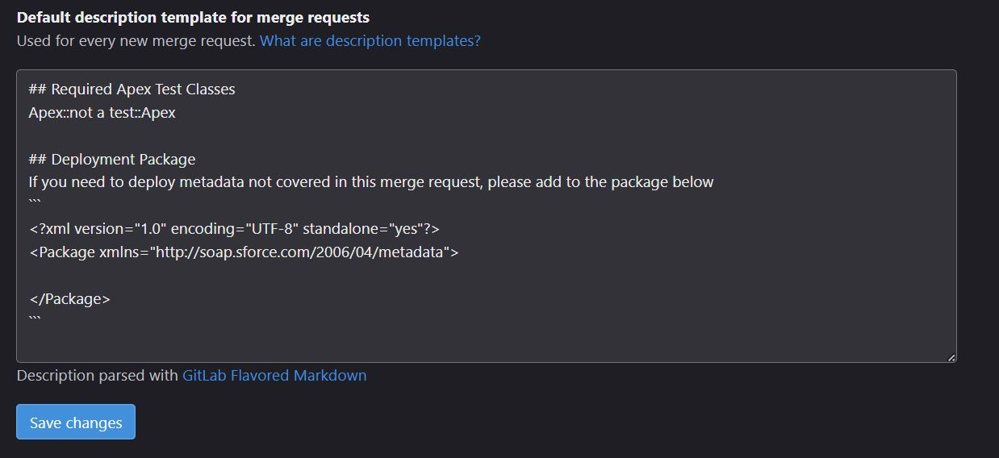

# Salesforce Org Model for GitLab CI/CD using the SF Executable
This repository contains Python scripts that demonstrate how to use GitLab actions to deploy metadata in a Salesforce org, following the org development model without using packages/scratch orgs. Each Salesforce org has its own long-running Git branch.

## Dependencies

The Dockerfile will install the latest SF CLI, Git, Python 3, and the SDFX Git Delta plugin on top of Ubuntu.

## YML Stages

The pipeline is divided into several stages:

- The `build` job builds a Docker image for the org if the Dockerfile has been modified. This Docker image is pushed to the GitLab Container Registry for the repository.
- The `quality` job runs a SonarQube scan of the repository if there are changes to the metadata directory. This assumes that your org has been configured with SonarQube with your GitLab instance. Ensure Pull Request decoration is enabled for your repository to enable SonarQube comments on merge requests. Ensure MR pipelines are enabled to run this scan when MRs are open into the target branch.
- The `develop`, `fullqa`, and `production` jobs represents 3 different Salesforce orgs linked to separate branches. When a merge request is opened with one of these branches as the target branch, a manually triggered pipeline will be created to validate the metadata in the org. When the branch is directly pushed to, a pipeline will automatically run to validate and quick-deploy the metadata to the org if there are Apex components in the package. If no Apex testing is required for the metadata, the validation will be skipped, and a full deployment will run. The org job can be copied multiple times depending on how many Salesforce orgs you would like to track in this repository.
    - Merged Result Pipelines should be enabled in the GitLab repo settings. Merged result pipelines are ideal for an accurate validation as long as there are no merge conflicts.

## Declare Metadata

This org model uses a manifest file (package.xml) to run delta deployments.

By default, the SFDX git delta plugin will create a package.xml by comparing the changes between the current commit and previous commit.

As a backup measure, the GitLab Merge Request description will be parsed via the merge commit message to look for package.xml contents.

The package.xml contents in the Merge Request should be used to declare any metadata that would not be covered by the diff between the current commit and the previous commit.

The following updates must be made to your GitLab repository:
- The default merge commit message should be updated to include the description of the MR for UI merges.

- The default merge request description template should be updated to include the required Apex string template.
- The default merge request description template should be updated to include the package.xml header and footer.

The scripts will merge metadata types from the plugin manifest file and the manual manifest file to create the final deployment package.

Note that the final deployment package cannot contain wildcard characters for delta deployments. 
If a metadata type contains a wildcard, the type will not be added to the final deployment package.

## Declare Apex Tests
Apex tests will be declared in the commit message with the following expression:
`Apex::Class1,Class2,Class3::Apex`

The entire "Apex" string is case insensitive.

The above string will be converted to the SF compatible string (multiple test classes separated by spaces).
